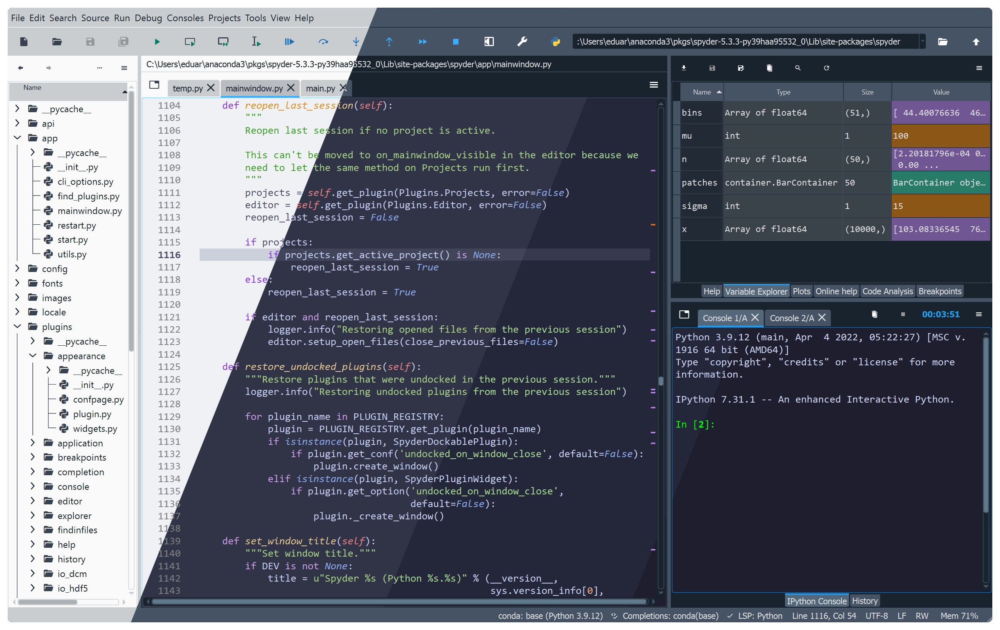
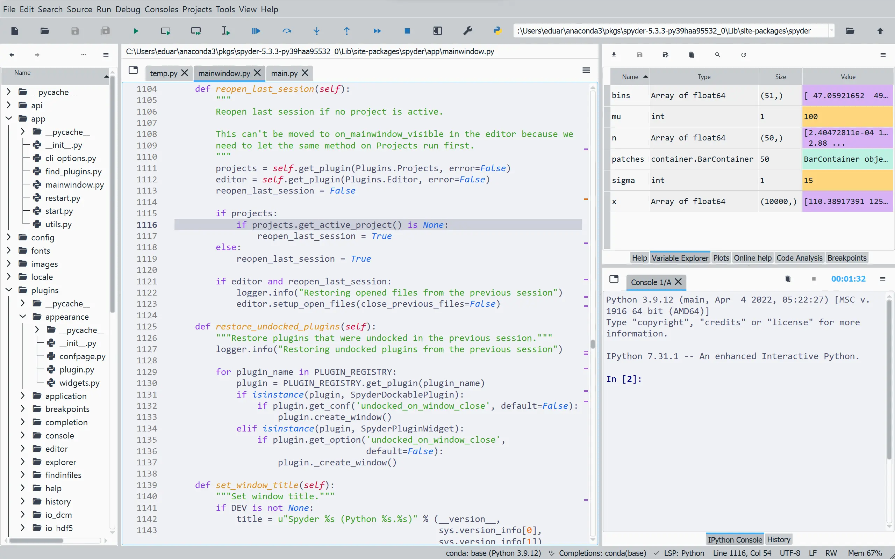
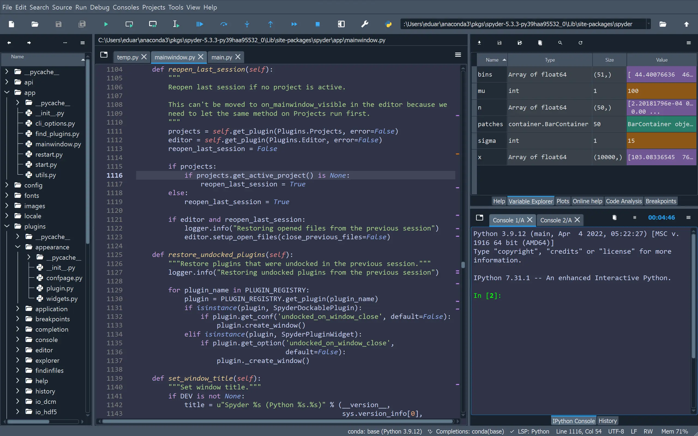
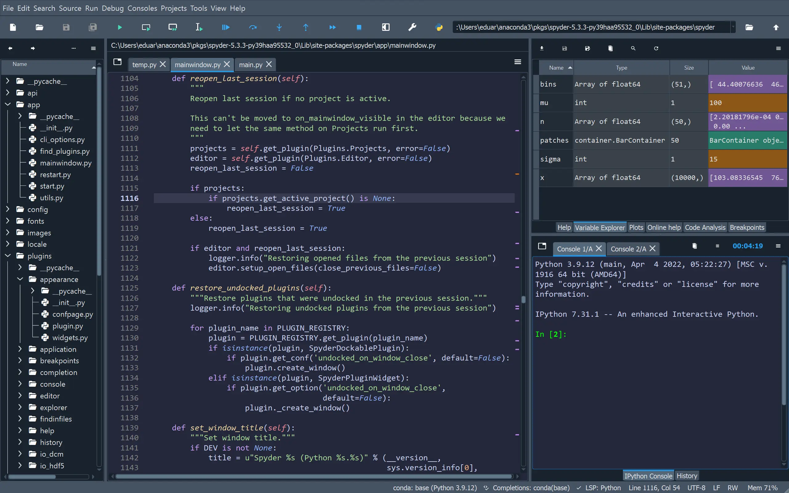
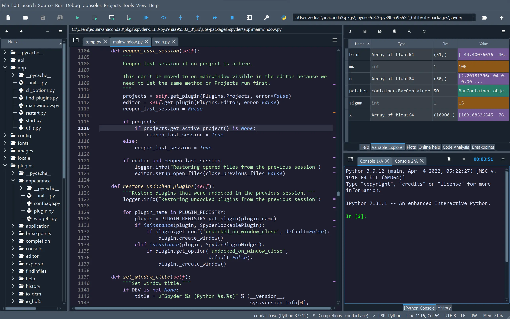

<h3 align="center">
	<br/>
	
	Catppuccin for <a href="https://www.spyder-ide.org/">Spyder</a>
	
</h3>

<p align="center">
	<a href="https://github.com/catppuccin/spyder/stargazers"></a>
	<a href="https://github.com/catppuccin/spyder/issues"></a>
	<a href="https://github.com/catppuccin/spyder/contributors"></a>
</p>

<p align="center">
	
</p>

## Previews

<details>
<summary>🌻 Latte</summary>

</details>
<details>
<summary>🪴 Frappé</summary>

</details>
<details>
<summary>🌺 Macchiato</summary>

</details>
<details>
<summary>🌿 Mocha</summary>

</details>


## Usage

1. With Spyder closed, open `~/.spyder-py3/spyder.ini`.
2. Scroll to the `[appearance]` section, and add your preferred theme(s) to the `names` option:

    ```ini
    [appearance]
    ...
    names = ['catppuccin/frappe', 'catppuccin/latte', 'catppuccin/macchiato',
             'catppuccin/mocha', 'emacs', 'idle', ..., 'zenburn']
    ```

3. Append the contents of either `themes/all.ini` or the specific flavor you would like (e.g. `themes/mocha.ini`) to the end of the `[appearance]` section.

> [!NOTE]
> The flavors you add must match the flavors you added to the `names` variable in Step 2.

4. Launch Spyder and change the theme in **Preferences** > **Appearance** > **Syntax Highlighting Theme**. If you are using latte, also switch the **Interface Theme** to **Light** or **Automatic**.

## Customization

You may modify the theme in **Preferences** > **Appearance** > **Edit Selected Theme**. 

> [!WARNING]
> Do not click **Reset to Defaults**. This will crash the preferences menu until you reinstall the theme.

## 🙋 FAQ

-	Q: **_"Why does the interface theme not change?"_** \
	A: Spyder does not currently allow theming of the window. We will add an interface theme when it is possible.

## 💝 Thanks to

- [meme8383](https://github.com/meme8383)

&nbsp;

<p align="center">
	
</p>

<p align="center">
	Copyright &copy; 2022-present <a href="https://github.com/catppuccin" target="_blank">Catppuccin Org</a>
</p>

<p align="center">
	<a href="https://github.com/catppuccin/catppuccin/blob/main/LICENSE"></a>
</p>
